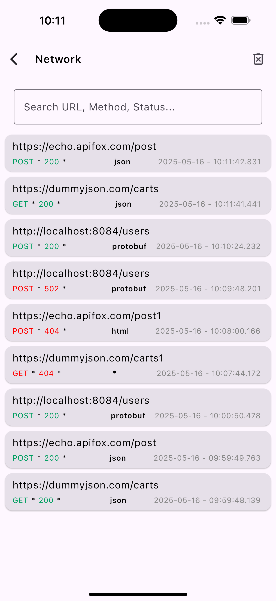
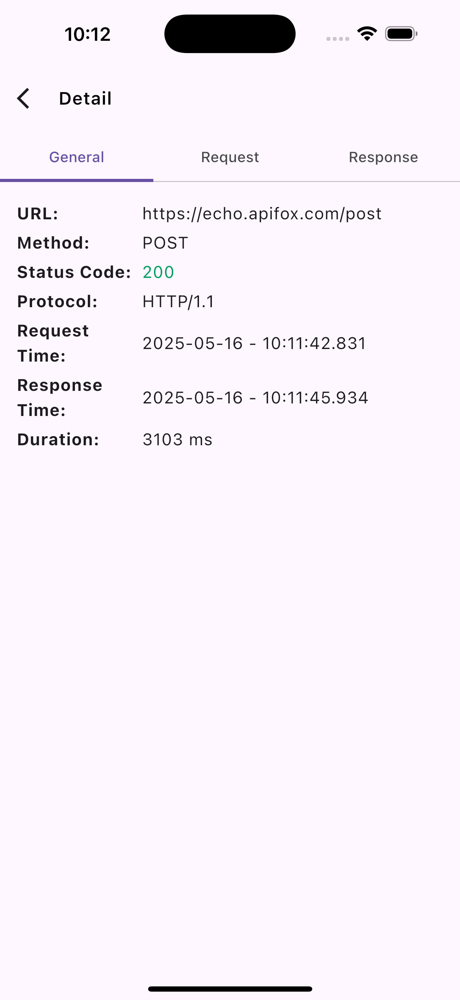
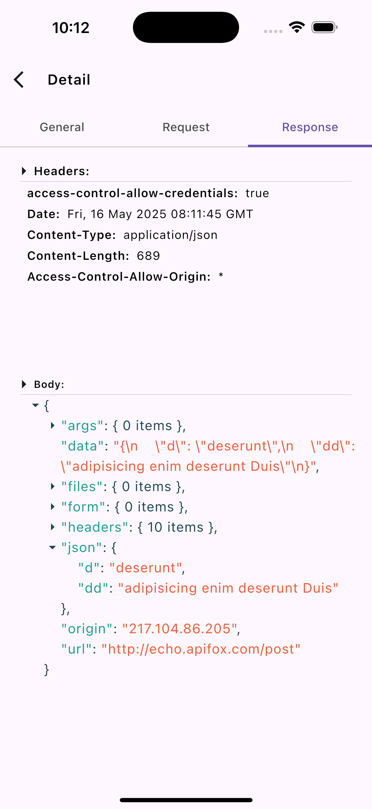
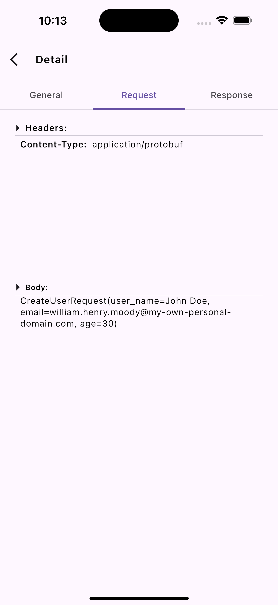
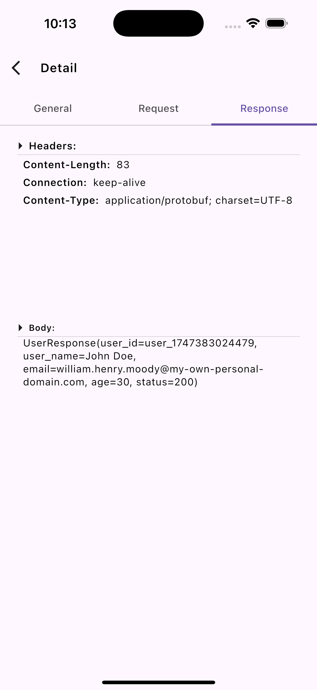

# KtorSniffer

[](https://search.maven.org/artifact/io.github.frankieshao/ktorsniffer)

**KtorSniffer** is a Kotlin Multiplatform library for logging, inspecting, and persisting HTTP network traffic in Ktor client applications. It is designed to help developers debug, analyze, and visualize network requests and responses across Android, iOS.

## Features

- **Automatic Logging**: Intercepts and logs all HTTP requests and responses made via Ktor client.
- **Persistence**: Stores network logs in a local database (Room).
- **UI Integration**: Comes with a ready-to-use Compose Multiplatform UI for browsing and inspecting logs.
- **ProtoBuf Support**: Handles ProtoBuf request/response bodies in addition to JSON and plain text.
- **Customizable**: Easily configure how to format ProtoBuf bodies.

## Screenshots

<div style="display: flex; flex-wrap: wrap; gap: 10px;">
  
  
  
  
  
</div>

## Getting Started

### 1. Add KtorSniffer to Your Project

> **Note:** Instructions below assume you have a Kotlin Multiplatform project with Ktor client and Compose Multiplatform set up.

Add the dependency to your shared module:

```kotlin
implementation("io.github.frankieshao:ktorsniffer:0.1.1")
```

### 2. Install the Plugin in Your Ktor Client

```kotlin

val client = HttpClient {
    install(Sniffer)
    // ... your other plugins
}
```

### 3. (Android) Initialize the Database

In your `Application` or main `Activity`:

```kotlin

class MyApp : Application() {
    override fun onCreate() {
        super.onCreate()
        KtorSniffer.init(this)
    }
}
```

> **Note:** You must call `KtorSniffer.init(context)` before using the log UI or DAO on Android.

### 4. Use the Compose UI

You can embed the provided Compose UI to browse and inspect logs:

```kotlin

@Composable
fun MyApp() {
    KtorSnifferScreen(onBack = { /* handle back navigation */ })
}
```

## How It Works

- **Interception**: The `Sniffer` plugin hooks into Ktor's client pipeline, capturing request and response data at multiple stages.
- **Persistence**: Logs are saved to a local database using a multiplatform DAO abstraction (Room on Android).
- **UI**: The Compose UI provides a searchable, filterable list of network logs, with detail views for headers, bodies, and errors.

## Configuration

You can customize logging behavior via the `SnifferConfig` DSL:

```kotlin
install(Sniffer) {
    protoBuf { /* configure ProtoBuf formatting */ }
    coroutineScope { /* provide custom CoroutineScope if needed */ }
}
```

## Supported Platforms

- Android (Room database, Compose UI)
- iOS (expect/actual for database, Compose UI)

## Example

See the `composeApp` module for a full sample app demonstrating GET/POST/ProtoBuf requests and the log UI.

## Roadmap

- [ ] Export logs to file
- [ ] Integration with other logging/analytics tools

## Contributing

Contributions, issues, and feature requests are welcome!  
Feel free to open an issue or submit a pull request.

## License

[MIT License](LICENSE)

---

**Enjoy debugging with KtorSniffer!**  
If you like this project, please star it on GitHub and share your feedback.
